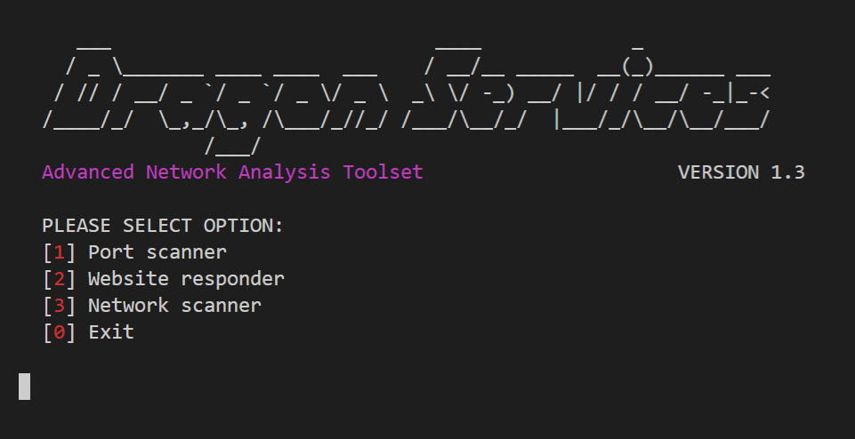
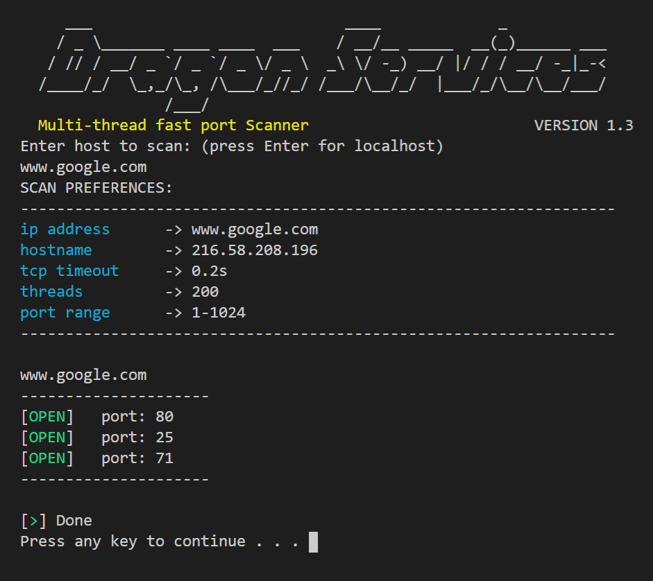
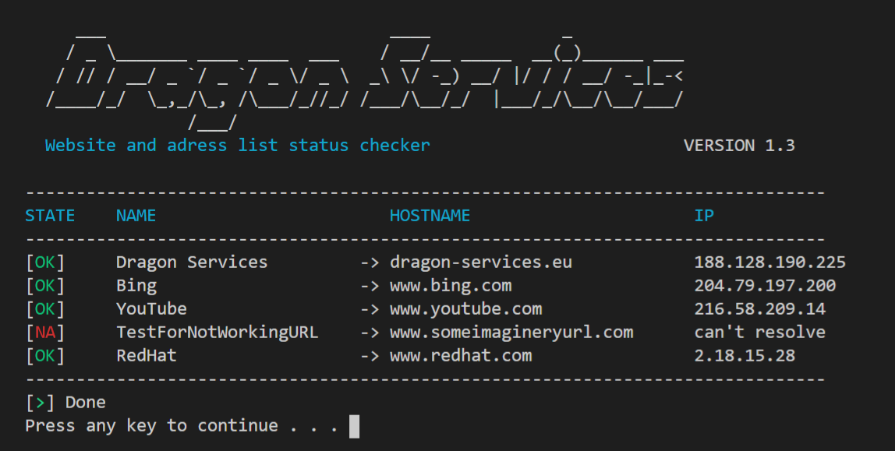

<h1>Responder</h1>

Dragon Responder is a multi-thread port scanner and address list auto checker.

It's cross-platform and it's been written in python with some dependecies listed below.

<h3>Dependencies</h3>

Remember to update your packet manager

<code>python -m pip install --upgrade pip</code>
<ul>
  <li>wheel</li>
  <li>netaddr</li>
</ul>

<h3>Features</h3>

  <h3>Main menu</h3>
   
  <h3>Port scanner</h3>
   
  <h3>Website responder</h3>
   

Status: <b>Development</b>

Version: <b>1.3</b>

